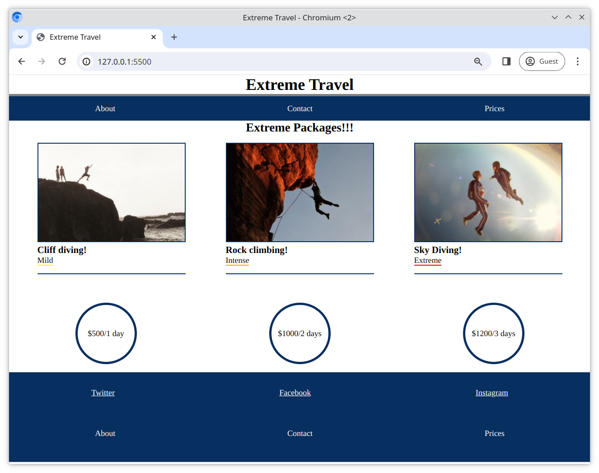

# Extreme Travel Website

The **Extreme Travel Website** is a project that demonstrates how to use DOM traversing techniques in JavaScript to create interactive and dynamic elements on a webpage.

## Features
- Highlights the main header with a bold grey border for better visibility.
- Enhances package details with dynamic styling for improved user experience.
- Categorizes and styles labels dynamically based on their intensity levels.
- Automatically duplicates navigation links into a site map for seamless navigation.

## Technologies Used
- **HTML5**: For the structure of the webpage.
- **CSS**: For styling and layout.
- **JavaScript (ES6)**: For dynamic DOM manipulation.

### Example Preview
Here’s a glimpse of what the page looks like:  


---

## Getting Started
1. Clone the repository to your local machine:
   ```bash
   git clone <repository-url>
  